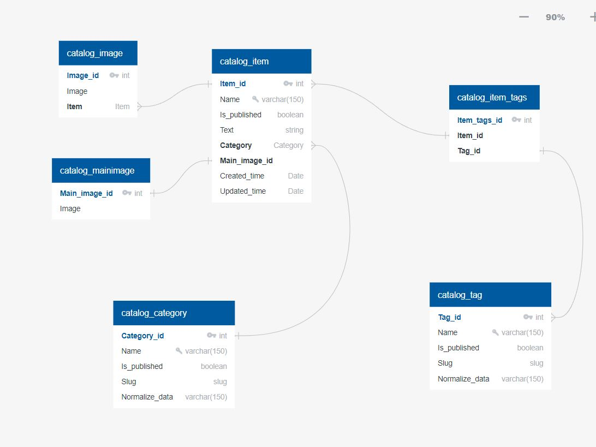

# DjangoProject


---
### Команды терминала по работе с проектом:

- Клонирование репозитория: 
```bash
git clone git@gitlab.crja72.ru:django_2023/students/162170-adeior-47331.git
```
- Установка виртуальной среды (venv): 
```bash 
python -m venv venv
```
- Активация виртуальной среды для linux(venv activation for linux): 
```bash 
source venv/bin/activate
``` 
или
```bash 
source venv/Scripts/activate
``` 
- Активация виртуальной среды для windows(venv activation for windows): 
```bash 
venv/bin/activate
``` 
или
```bash 
venv/Scripts/activate
``` 
- Установка продовых зависимостей для проекта (installation of requirements for prod): 
```bash 
pip install -r requirements/prod.txt
```
- Запуск сервера (run command): 
```bash 
python manage.py runserver
```
#### Примечание:
Перед запуском сервера нужно перейти в папку с manage.py, то есть в lyceum. Пример такой команды: 
```bash 
cd lyceum
```

---
### Работа с файлом .env
В корневой папке должен быть файл .env, который содержит такие параметры, как 'DJANGO_SECRET_KEY', 'DJANGO_DEBUG' и 'DJANGO_ALLOWED_HOSTS'. 
Примером такого файла служит .env.template. 
При этом в ключе 'DJANGO_ALLOWED_HOSTS' значения должны быть написаны через запятую.
---
### Структура базы данных
Полная структура базы данных, используемая в проекте, показана в файле 'ER.JPG'

